# Money Graph architecture

```mermaid
flowchart LR
    P[Parquet data<br/>nodes · edges · transactions] --> V[Validation]
    V --> G[Canonical directed weighted graph<br/>all supplied nodes and isolates]
    G --> F[Graph, temporal and seed features v2<br/>availability flags and bounded patterns]
    F --> L[Louvain clustering<br/>canonical amount-weighted undirected projection]
    L --> R[Analytics-owned role engine<br/>shared percentiles and winning-rule diagnostics]
    R --> Q[Analytics-owned priority engine]
    Q --> E[Deterministic explanations]
    E --> X[Strict CSV exports<br/>six-field nodes_roles · clusters · top_nodes]
    E --> FOUT[Auxiliary node_features.parquet<br/>metrics · validity flags · rules · priority explanations]
    G --> RES[Resilience scenarios<br/>weak connectivity after ranked removals]
    Q --> RES
    RES --> ROUT[resilience.csv]
    P --> M[run_metadata.json<br/>input and output SHA-256 · versions · runtime]
    X --> M
    FOUT --> M
    ROUT --> M
    X --> JOIN[Exact gid one-to-one join<br/>CSV decisions authoritative]
    FOUT --> JOIN
    M --> CHECK[Provenance and freshness verification]
    P --> CHECK
    ROUT --> CHECK
    JOIN --> CHECK
    CHECK --> UI[Streamlit analyst UI<br/>offline embedded assets]
    X --> S[submission/<br/>three validated CSVs and release manifest]
    M --> S
    UI --> LLM[Optional grounded LLM assistant]
    LLM --> T[Read-only deterministic graph tools]
    T --> JOIN
    CHECK --> T
    T --> LLM
    LLM --> CITE[Validate each cited field and value<br/>exact existing-gid navigation]
    CITE --> UI
```

The integrated feature layer follows [contract v2](feature-contract.md) and the
[supplied-data profile](data-quality.md). Roles, priority, clustering and strict
exports follow [brief-decisions-v1](decision-rules.md). Exact gid joins retain
the CSV decisions and attach the complete auxiliary metrics; conflicting
decision fields are rejected.

The shared pipeline stages and validates artifacts before publishing a completed
manifest with input/output hashes, schema/rule identities and environment details.
The viewer checks those hashes and file freshness before combining exported
decisions with source graph context. Source files remain read-only; generated
working outputs and the final submission package have separate destinations.

The interface reads exported scores and explanations. The optional model selects
evidence through deterministic tools; a local validator checks each cited field
and value and constructs navigation only for existing exact gids. Unrestricted
model prose does not become verified evidence. Core analytics and the offline
viewer require neither the model nor an API key.
