# Money Graph architecture

```mermaid
flowchart LR
    FILES[Configured Parquet files<br/>read-only data directory] --> SNAP[Validated input snapshot]
    UPLOAD[Sidebar upload of three Parquets] --> PRIVATE[Private temporary case workspace]
    PRIVATE --> SNAP

    subgraph ANALYTICS[Same local analytical pipeline]
        SNAP --> G[Canonical directed graph<br/>all nodes and isolates]
        G --> F[Graph and temporal features<br/>seed reach · censoring · bounded patterns]
        F --> C[Canonical Louvain communities]
        C --> R[Documented role rules<br/>gates · weights · winning diagnostics]
        R --> P[Priority and explanations<br/>eight exported contributions]
        P --> X[Strict three CSVs<br/>nodes_roles · clusters · top_nodes]
        P --> AUX[Rich node_features.parquet]
        G --> RES[Resilience scenarios]
        P --> RES
        RES --> AUXRES[resilience.csv]
        X --> M[Completed run manifest<br/>hashes · versions · validation · runtime]
        AUX --> M
        AUXRES --> M
        SNAP --> M
    end

    M --> CHECK[Input/output provenance and freshness checks]
    X --> JOIN[Exact gid one-to-one join<br/>CSV decisions authoritative]
    AUX --> JOIN
    CHECK --> UI[Offline analyst viewer<br/>queue · cards · directed graph · clusters]
    JOIN --> UI
    AUXRES --> UI
    UI --> SELECT[Run-scoped review shortlist]
    SELECT --> REVIEW[Review CSV<br/>why · limitations · next request · run ID]
    X --> BUNDLE[Submission ZIP<br/>three CSVs and release manifest]
    M --> BUNDLE
    X --> RELEASE[CLI submission directory<br/>three CSVs and release manifest]
    M --> RELEASE

    UI --> AI[Optional external LLM]
    AI --> TOOLS[Read-only graph tools]
    CHECK --> TOOLS
    JOIN --> TOOLS
    TOOLS --> CITE[Validate cited fields and values<br/>known-gid navigation]
    CITE --> UI
```

## Input and run lifecycle

The CLI accepts configured source/output directories. The sidebar's **Upload case
dataset** accepts the three Parquets and **Validate and run uploaded case** invokes
the same pipeline through `src/workspace.py`; source data and configured exports
are not overwritten. Uploaded bytes, the input snapshot and generated artifacts
remain in a private temporary workspace. **Use configured dataset** returns to the
original source/export selection. The current release accepts the supplied 2,248-node case shape. Download the case
handoff before resetting its temporary workspace.

The pipeline validates endpoints, exact identifiers, amounts, dates and aggregate
reconciliation before calculating features. It stages and validates all outputs
before publishing a completed manifest. Input/output SHA-256 hashes, implementation
and schema versions, environment and runtime associate a result with the data and
code that produced it. The viewer verifies the run before joining source graph
context and decisions; file changes invalidate cached results. A changed run clears
the analyst's shortlist and stale AI response.

## Analytical and consumer contracts

The feature layer follows [contract v2](feature-contract.md) and the
[supplied-data profile](data-quality.md). Roles, priority, clustering and exports
follow [brief-decisions-v1](decision-rules.md). Directed flow features retain payment
direction; only community detection receives an amount-weighted undirected
projection. All supplied nodes remain represented, including isolated seeds.

The six fields in `nodes_roles.csv` are authoritative. The auxiliary Parquet joins
one-to-one on exact gids and supplies metrics, valid/missing flags, role diagnostics
and priority contributions. Conflicting decisions or mismatched run artifacts are
rejected. Large gids remain integers in computation and decimal strings in browser
payloads. The UI displays exported decisions rather than computing its own scores.

Seed inflow incompleteness, hop-4 outgoing censoring and partial date windows remain
explicit from features through decision eligibility and analyst explanations.
Date patterns do not establish intraday ordering or trace the same funds. Route
limits and amount-pattern evidence are visible alongside their limitations.

## Analyst handoff and optional AI

The queue's **Review shortlist** selects exact gids from the active run.
**Download review shortlist** exports `gid, role, role_score, cluster_id,
priority_score, evidence, why, limitations, next_request, run_id`. Next-data
requests use the same observation logic as the node card. This is an analyst review
record and does not modify the official decisions or automatically contact others.

**Download submission bundle** exports the three strict CSVs with a
`release_metadata.json` derived from the active run. The CLI's separate `--submission` package uses a release
manifest and remains available for reproducible jury delivery. The normal
configured `out/` directory remains disposable; supplied source files stay read-only.

The optional model uses deterministic graph tools. A local validator checks cited
fields and values and only creates navigation for known exact gids. Unrestricted
model prose is not accepted as verified evidence. Core analytics, upload/run,
visualization and downloads require neither the model nor an API key; model calls
are the only intentional external runtime service.
