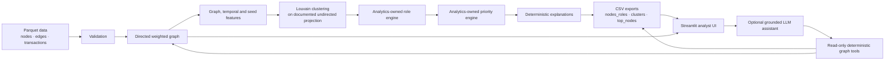

# Money Graph architecture

The interface is intentionally downstream from the final role and priority
engines. It reads their exported scores and explanations; it does not reimplement
or mutate analytic decisions. The optional LLM receives data only through the
read-only deterministic tool layer and is not required by the pipeline or UI.
